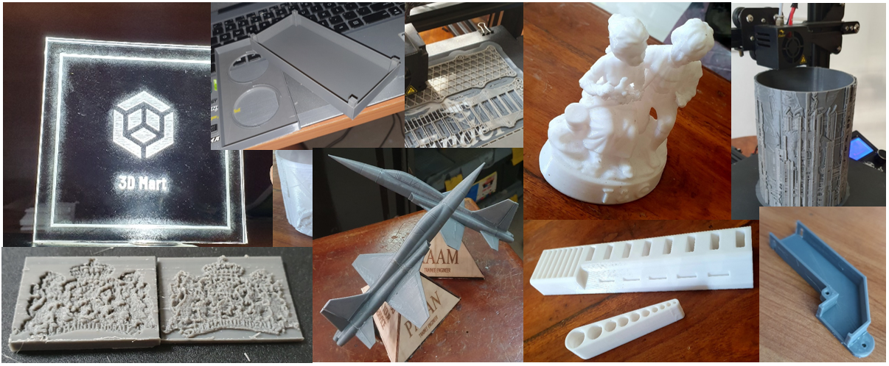
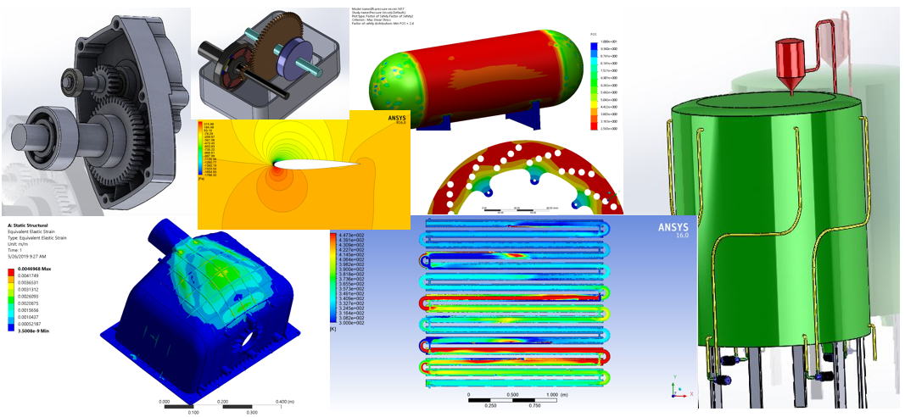

During my final year as an undergraduate, I established 3D Mart, a business offering tailored solutions in 3D printing and engineering services. My work encompassed everything from creating physical prototypes to providing advanced engineering simulations for clients. This venture combined my technical skills and entrepreneurial spirit, enabling me to deliver innovative solutions across various industries.

3D Printing Services
======
At 3D Mart, I provided custom 3D printing solutions, leveraging my Creality Ender 3 printer to produce high-quality, precise prototypes. These services were tailored to meet diverse client requirements, including design validation, product development, and educational applications. My expertise in print preparation ensured optimal results, with careful attention to material selection, layer thickness, and support structure design. Each project prioritized durability, detail, and aesthetic appeal, offering clients reliable models for testing and presentation purposes.

Some 3D prints done under client demand

3D Modeling, CFD, and FEA Simulations
======
Beyond printing, I offered engineering services focused on 3D modeling, Finite Element Analysis (FEA), and Computational Fluid Dynamics (CFD) simulations. Using advanced tools like SolidWorks and ANSYS, I tackled engineering challenges such as structural integrity assessments, thermal analysis, and fluid dynamics evaluations. These services enabled clients to refine designs and predict performance metrics, identifying potential issues before physical prototyping. This combination of 3D modeling and simulation provided clients with comprehensive insights and solutions tailored to their specific needs.

Some 3D modeling and simulations ran under client demand

