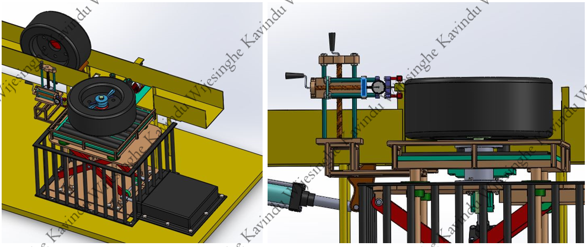

During my third year as an undergraduate in the Department of Mechanical Engineering, I completed a six-month mandatory industrial internship at the Research and Development (R&D) Department of the Wheel Manufacturing Division at Camso Loadstar PVT. LTD., one of the world’s leading manufacturers of off-road tires. This internship marked a pivotal moment in my career, fueling my passion for automation, manufacturing, and metallurgy.

The factory environment was highly automated, providing me hands-on experience with lean manufacturing, CNC programming, industrial automation, welding, manual machining, wire EDM, and machine design. These skills laid the groundwork for my future endeavors in engineering and automation.

Internship Experience: Designing an Automated Tire Runout Checking Device
======
My primary project, undertaken alongside my batchmate Gihan, was to design an automated tire runout checking device with pneumatic actuation to enhance quality control within the tire assembly process. This device aimed to streamline the inspection process, ensuring precise measurements and improving overall reliability in manufacturing.

Using SolidWorks and AutoCAD, we developed a comprehensive and detailed design for the machine, incorporating all necessary components for automated operation. The machine was designed to be entirely fabricated in-house, utilizing available resources and ensuring assembly could be completed in just a few days. By integrating automation into the production line, the device enhanced efficiency, reduced inspection time, and minimized errors in quality control.

Beyond technical contributions, this internship was transformative for my professional growth. Working in a dynamic R&D environment, I developed a strong appreciation for the intersection of automation and manufacturing technologies. It solidified my interest in pursuing innovative solutions to engineering challenges, setting the stage for my future academic and professional pursuits.

Designed automated tire runout checking device.

