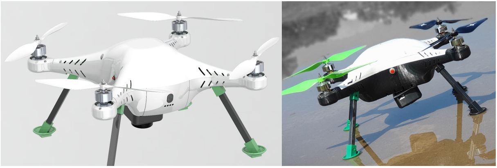
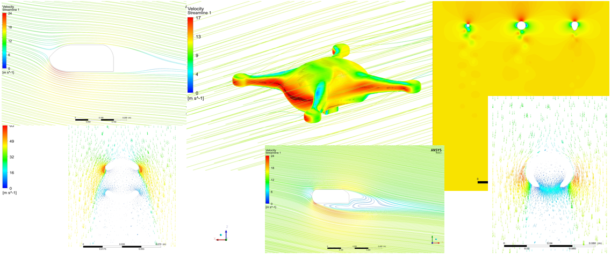
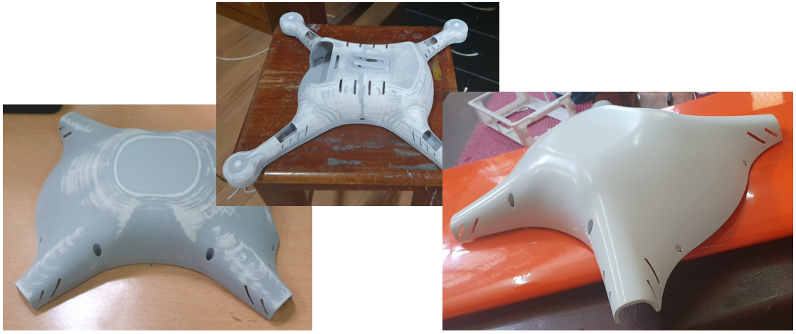
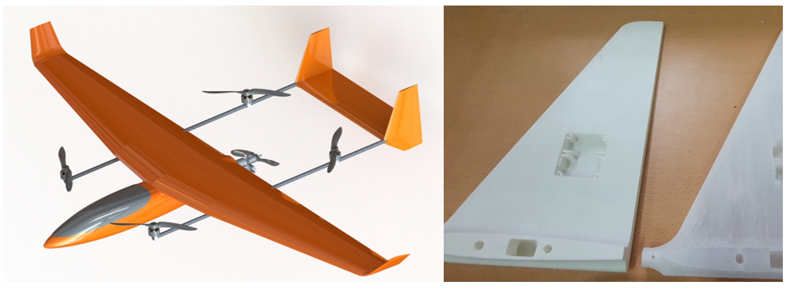

After graduation, I joined the AHEAD UAV Laboratory, a startup led by Professor Rohan Munasinghe in the Department of Electronics and Telecommunication at the University of Moratuwa. As a Mechanical Engineer, I focused on UAV design and prototyping, contributing to cutting-edge projects that merged mechanical engineering with aerospace innovation. My primary work involved developing Mora-X, a quadcopter designed for aerial mapping, and initiating the design of a vertical take-off and landing (V-TOL) UAV. These projects allowed me to integrate advanced topology optimization techniques and hands-on prototyping expertise.

Mora-X: A Quadcopter for Aerial Mapping (Original design: applied for design patent)
======
I conceptualized, designed, and prototyped Mora-X, a quadcopter tailored for aerial mapping, and applied for a design patent for this original work. The project emphasized optimizing aerodynamics, weight distribution, and aesthetic appeal to create a commercially viable product. Using advanced topology optimization techniques in SolidWorks, Ansys, and AutoCAD, I iterated through several design versions to ensure maximum flight efficiency and structural integrity.

# Prototyping Process:
 - I fabricated the prototype using an Ultimaker 3S 3D printer with PLA material, ensuring precision and reliability. To enhance durability, I polished and spray-painted the surfaces with heat-resistant paint, preventing deformation during high-temperature operations.

# Key Achievements:

 - Successfully reduced overall weight without compromising structural strength.
 - Achieved an aerodynamically efficient design, enhancing flight time and stability.
 - Integrated sleek, marketable aesthetics to position Mora-X as a sellable product.

Final design and prototype of the final Mora-X quadcopter

Aerodynamic and structural simulations for optimizing the design

Fabrication of different components

Vertical Take-Off and Landing (V-TOL) UAV
======
I contributed to the conceptual and preliminary design of a V-TOL UAV. This project aimed to develop a UAV capable of combining the flexibility of vertical take-off with efficient horizontal flight. While I transitioned to my role at Clarkson University before completing this project, I played a pivotal role in initiating its design and direction.

Preliminary design of V-TOL UAV

Additional Experience
======
My work at the AHEAD UAV Laboratory also provided hands-on experience with:

 - Laser cutting and precision fabrication techniques.
 - Flying and testing UAVs in controlled environments.
 - Ground station monitoring for UAV operations.
 - Understanding and integrating electronic systems in UAV designs.
This role allowed me to merge my engineering expertise with practical aerospace applications, leaving a lasting impact through the patented Mora-X design and other UAV innovations.

An article published in a local newspaper about the startup

