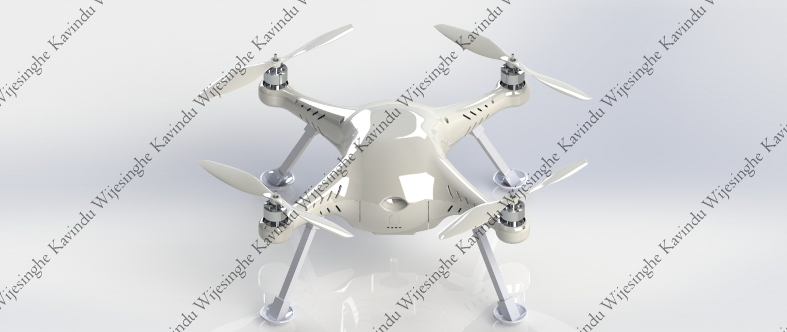
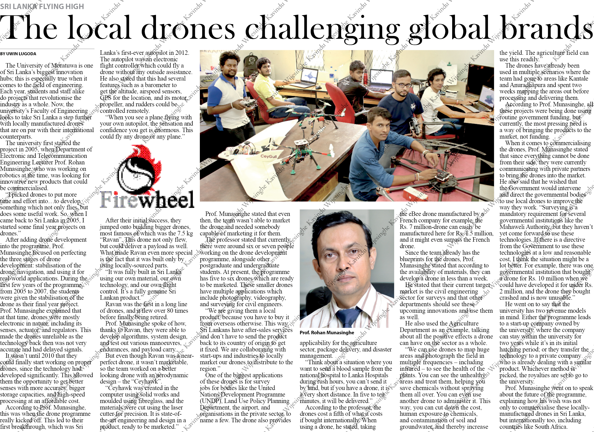

As a Mechanical Engineer in the UAV Laboratory at the University of Moratuwa, I led the design and prototyping of Mora-X, a quadcopter tailored for aerial mapping. This project emphasized optimizing aerodynamics and weight distribution using advanced topology optimization techniques in SolidWorks, Ansys, and Fusion360. The work underscored a focus on precision engineering to enhance UAV performance in real-world applications.

Development of Aerodynamically and topology-optimized quadcopter body (Original design: applied for design patent)
======
Designed and prototyped a quadcopter (Mora-X) for aerial mapping, optimizing aerodynamics and weight distribution through topology optimization using SolidWorks, Ansys, and Fusion360.

3D model of the final Mora-X quadcopter design

An article published in a local newspaper about the startup

