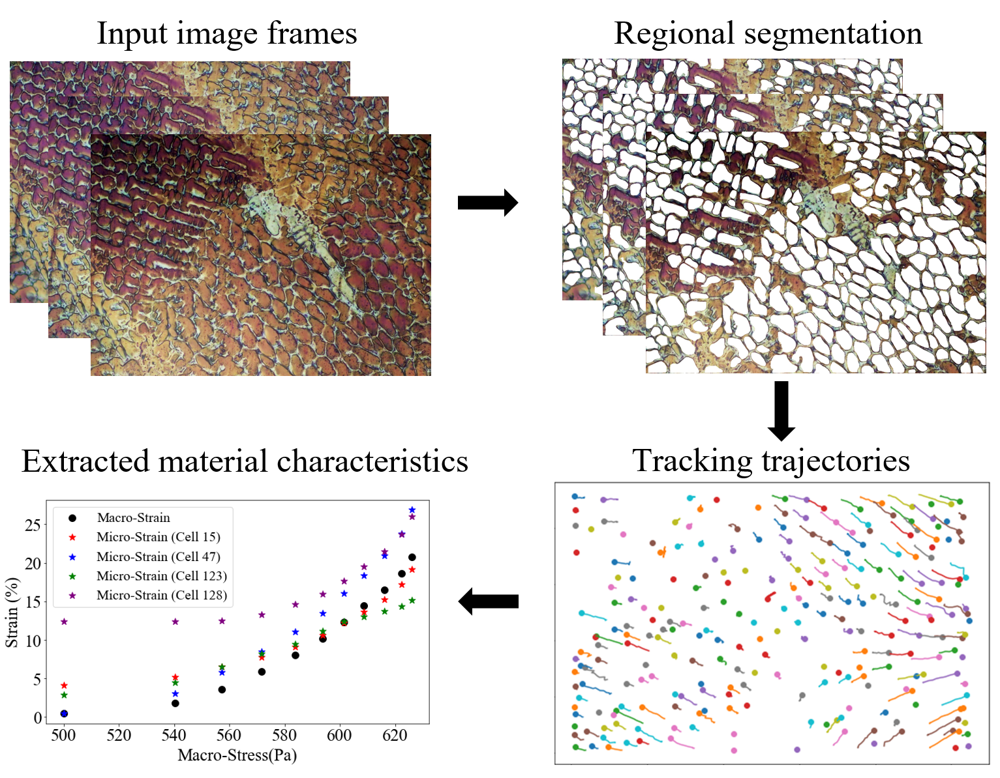

In my role as a Research Assistant and MS Candidate at Clarkson University, I specialized in developing automated systems and deep learning solutions for precise material testing. My work included designing a patent-pending micro-tensile testing system featuring a fully automated, high-resolution imaging setup for real-time analysis. I also pioneered a deep learning framework to enhance microscopic strain measurement by tracking microstructural features in in-situ videos, achieving unprecedented accuracy in strain analysis. These projects represent my commitment to advancing material testing through automation and AI innovation.

Project 1
======
Automated In-Situ Testing System: Designed a patent-pending, fully automated, micro-tensile testing setup with a 3-axis motorized stage, precision stepper motors, and integrated software for feature tracking, autofocus, and image processing. This system achieves high-resolution imaging at multiple magnifications, allowing real-time analysis in less than 8.5 minutes.

Project 2
======
Deep Learning for Microscopic Strain Measurement: Developed a deep learning-based framework to segment and track microstructural features in in-situ micro-tensile videos, enhancing accuracy in local strain measurement.

