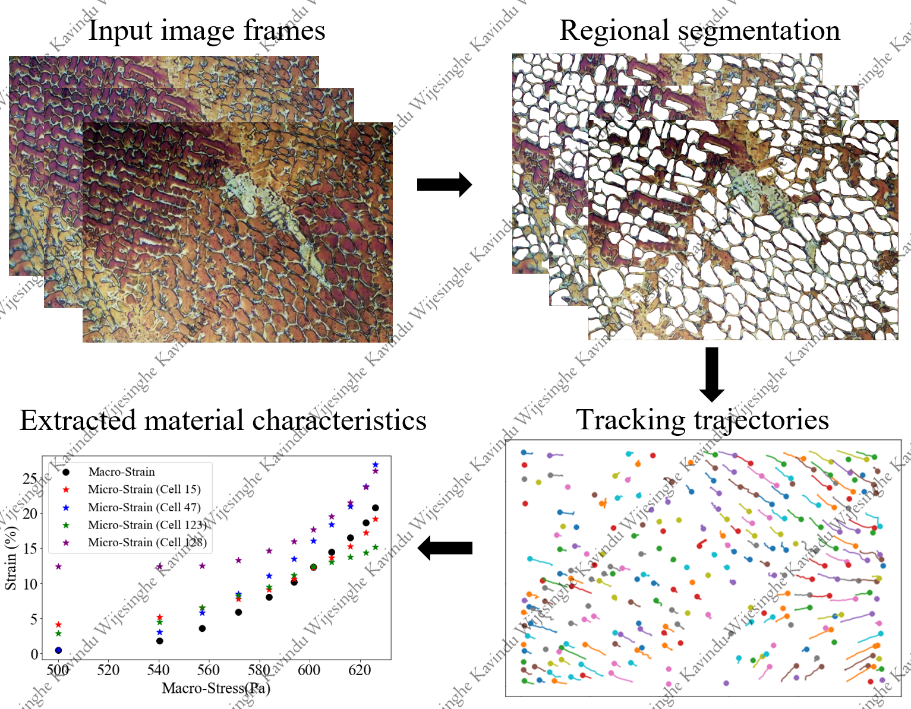

In my role as a Research Assistant and MS Candidate at Clarkson University, I specialized in developing automated systems and deep learning solutions for precise material testing. My work included designing a patent-pending micro-tensile testing system featuring a fully automated, high-resolution imaging setup for real-time analysis. I also pioneered a deep learning framework to enhance microscopic strain measurement by tracking microstructural features in in-situ videos, achieving unprecedented accuracy in strain analysis. These projects represent my commitment to advancing material testing through automation and AI innovation.

Development of Automated In-Situ Testing System
======
Designed a patent-pending, fully automated, micro-tensile testing setup with a 3-axis motorized stage, precision stepper motors, and integrated software for feature tracking, autofocus, and image processing. This system achieves high-resolution imaging at multiple magnifications, allowing real-time analysis in less than 8.5 minutes.

Smart in-situ tensile testing system

Characterization of microscopic deformation of materials using deep learning algorithms
======
A microstructure-informed design approach is set to revolutionize the design of metals and alloy components for aerospace applications. In this approach, a designer utilizes the influence of individual microstructural features on microscopic deformation to yield desirable macroscopic properties. Therefore, the development of advanced experimental capabilities that enable detailed characterization of microscopic deformation of material test specimens is critical to realize this paradigm shift in practice. However, extracting the complex characteristics of microscopic deformation hidden in raw image data is quite challenging. In this article, we propose an automated data extraction and analysis method based on instance segmentation and tracking of microstructural features using deep learning (DL) and image processing algorithms. The method consists of a trained mask Region-based Convolutional Neural Network (mask R-CNN) DL model combined with a regional instance segmentation approach for the instance segmentation of features, an intersection over union-based multi-object tracking method to track segmented instances as they deform, and kinematics models to extract the material characteristics from the geometrical data of the deforming instances. The method is then validated by characterizing the microscopic deformation of an additively manufactured 316L stainless steel coupon specimen under quasi-static tensile loading. Our study presents a general framework for advancing deep learning algorithms to solve complex problems in the field of experimental mechanics.

Publication: Characterization of microscopic deformation of materials using deep learning algorithms, Material & Design 2021

Talk 1: Characterization of Microscopic Deformation of Materials Using Deep Learning Methods, MS&T 2021, Columbus, Ohio, USA
Talk 2: Characterization of microscopic deformation of materials using computer vision, AIAA Scitech 2023, National Harbor, MD, USA

Deep Learning based microscopic strain measuring technique for in-situ data

