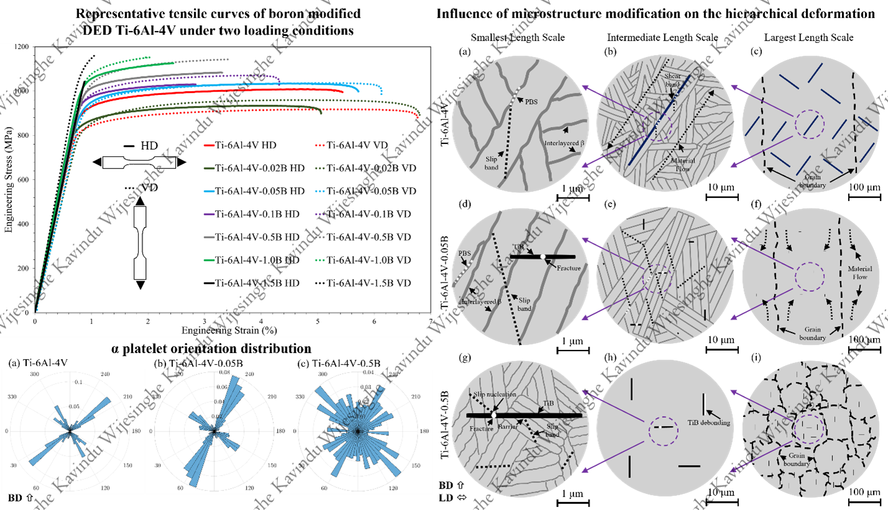

As a Research Assistant and Ph.D. Candidate at Clarkson University, I have dedicated my efforts to advancing the understanding of the process-structure-property relationships in additively manufactured high-performance alloys. My research employs a combination of experimental methods and data-driven approaches, spanning the design of novel alloys to the development of innovative tools that elevate the standards of conventional materials characterization. This work bridges materials science with cutting-edge computer vision technologies.

During my time at Clarkson, I have had the privilege of contributing to several impactful projects in the field of Materials Science and Engineering, with my findings published in Q1 journals. Key projects include:

 - Investigating deformation mechanisms influenced by microstructural features that result in anisotropic mechanical properties of Directed Energy Deposited (DED) Ti-6Al-4V.
 - Designing boron-modified DED Ti-6Al-4V alloys for enhanced tensile performance by identifying the optimal boron composition and analyzing the microstructural and deformation mechanisms driving the observed behavior.
 - Precisely measuring residual stresses in SLM (Selective Laser Melting) builds to validate computational simulation data.
 - Physics-Informed Generative AI for Predicting Material Deformation: Latent Diffusion Modeling from Undeformed Microstructures.
 
These projects highlight a commitment to improving alloy performance and reliability in advanced manufacturing applications, emphasizing both practical innovation and scientific rigor.

Investigating the deformation mechanisms driving the anisotropic mechanical properties of Directed Energy Deposited (DED) Ti-6Al-4V
======
A comprehensive study is undertaken to investigate the evolution of microscopic deformation under in-situ uniaxial tensile testing of the Directed Energy Deposited (DED) Ti-6Al-4V alloy. The study uncovered a synergistic influence of the (α+β) lamellar microstructural features at different length scales, leading to distinct deformation mechanisms and barrier effects. At the smallest length scale, the deformation mechanisms are lattice slipping and phase boundary sliding (PBS), with a characteristic length scale comparable to the dimensions of α platelets and colonies. The slipping and PBS encountered complex barrier effects at β interlayers. At the intermediate length scale, a mechanism of strain localization manifests as shear bands along a 45o orientation to the uniaxial loading direction. The strain localization involves the activation of multiple slipping events and exhibits a propensity to choose large unobstructed phase-boundary pathways for its realization. At the highest length scale, grain boundaries introduce another barrier effect to both slipping and strain localization through intergranular deformation compatibility. The synergistic interplay between these three mechanisms constitutes a hierarchical response, enabling the material to effectively accommodate large plastic deformation. Moreover, the synergistic interplay influences the anisotropy of the material.

Publication: Hierarchical Anisotropic Material Response of Directed Energy Deposited (DED) Ti-6Al-4V alloy, Acta Materialia 2024

Talks: Experimental Analysis of Various Microscopic Deformation Mechanisms of Directed Energy Deposited Ti-6Al-4V, TMS 2024, Orlando, Florida, USA

Designing boron-modified DED Ti-6Al-4V alloys for enhanced tensile performance by identifying the optimal boron composition and analyzing the microstructural and deformation mechanisms driving the observed behavior
======
This study investigates the influence of boron addition on the mechanical properties, microstructure, and deformation behavior of Ti-6Al-4V alloy fabricated via Directed Energy Deposition (DED). Ti-6Al-4V blocks with boron concentrations ranging from 0 wt.% to 1.5 wt.% were printed, and uniaxial tensile tests were performed on specimens extracted in both parallel and perpendicular orientations to the build direction. The results reveal that boron addition leads to significant microstructural refinement and a non-monotonic relationship between boron content and mechanical properties. Up to 0.05 wt.% boron, strength, and flow stress in both build directions increased, while anisotropy was reduced, achieving an optimal balance of isotropy, strength, and ductility. Beyond 0.05 wt.%, further boron additions caused a reemergence of anisotropy, with increased strength in the build direction and decreased ductility. Microstructurally, boron reduced the aspect ratio of prior-β grains, promoted a more equiaxed structure, and induced the formation of TiB needles, which aligned with the build direction at higher concentrations. These microstructural changes suppressed typical hierarchical deformation mechanisms in Ti-6Al-4V, including phase boundary sliding (PBS), shear strain localization (SSL), and grain boundary-constrained material flow. Strengthening mechanisms at the microscopic level were driven by the reduction in dislocation glide mean free path, altered intergranular deformation compatibility, and stress partitioning to TiB needles, with the latter contributing to the observed anisotropy reversal at higher boron levels. These findings offer valuable insights into tailoring the mechanical properties of DED Ti-6Al-4V via boron addition, highlighting its potential to optimize performance for demanding engineering applications.

Publication: Boron Addition for Enhanced Mechanical Properties in Directed Energy Deposited (DED) Ti–6Al–4V: Underlying Mechanisms, Submitted to Journal of Alloys and Compounds

Talks: Influence of Boron Addition on Tensile Properties on DED Ti-6Al-4V, TMS 2023, San Diego, California, USA

Precisely measuring residual stresses in SLM (Selective Laser Melting) builds to validate computational simulation data
======

Residual Stress Measurement: To validate computational predictions, residual stress values were measured using the separation method (Separated the block from the build plate using a band saw) on a Selective Laser Melted (SLM) AlSi10Mg four-walled build. The measurements were made using 8 uniaxial 350-ohm strain gauges (HBK) mounted on 3 outer walls to measure horizontal and vertical strains.

I used two DAQ devices (National Instruments (NI) 6211 and NI 9184) and NI LabView software for data logging.

Physics-Informed Generative AI for Predicting Material Deformation: Latent Diffusion Modeling from Undeformed Microstructures (Work is ongoing)
======
This research introduces a physics-informed generative AI framework that utilizes Latent Diffusion Models (LDMs) to predict microstructural deformation in materials by leveraging undeformed optical microscopy images alongside embedded crystallographic data. Conditioning the LDM with experimentally derived insights, our approach achieves high-fidelity predictions of critical deformation processes up to higher strain levels, capturing phenomena such as slip band evolution and grain boundary migration under uniaxial tensile loading. Through fine-tuning on high-resolution stainless steel 316L datasets, generated via in-situ tensile testing with panoramic imaging, this work integrates physics-informed machine learning with experimentally validated material deformation modeling. By synthesizing time-sequenced data that reflects both evolving and emergent microscopic features, this method offers a scalable, resource-efficient alternative for alloy design and testing, advancing toward next-generation materials with tailored mechanical properties and providing rapid, predictive insights into material behavior under complex loading conditions.

Talks: A Deep Learning Framework for Predicting Surface Deformation of Alloys under Uniaxial Tensile Loading at Microscopic Length Scale, TMS 2025, Las Vegas, Nevada, USA (Upcoming)
